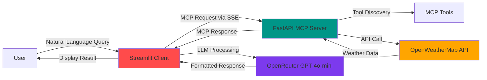

<div align="center">

# 🌦️ Weather Agent

### AI-Powered Weather Assistant with MCP Integration

[](https://www.python.org/)
[](https://fastapi.tiangolo.com/)
[](https://streamlit.io/)
[](https://www.docker.com/)
[](https://modelcontextprotocol.io/)

An intelligent weather assistant that leverages the **Model Context Protocol (MCP)** to seamlessly connect AI models with real-time weather data from OpenWeatherMap.

[Features](#-features) • [Architecture](#-architecture) • [Quick Start](#-quick-start) • [Usage](#-usage) • [API Reference](#-api-reference)

</div>

---

## 📋 Table of Contents

- [Overview](#-overview)
- [Features](#-features)
- [Architecture](#-architecture)
- [Prerequisites](#-prerequisites)
- [Quick Start](#-quick-start)
- [Project Structure](#-project-structure)
- [Configuration](#-configuration)
- [Usage](#-usage)
- [API Reference](#-api-reference)
- [Docker Deployment](#-docker-deployment)
- [CI/CD Pipeline](#-cicd-pipeline)
- [Troubleshooting](#-troubleshooting)
- [Contributing](#-contributing)
- [License](#-license)

---

## 🌟 Overview

The **Weather Agent** is an advanced conversational AI application that provides real-time weather information through natural language queries. Built on the Model Context Protocol (MCP), it creates a standardized communication layer between AI models and external tools, enabling seamless weather data retrieval and intelligent responses.

### What is MCP?

The **Model Context Protocol** is a universal standard for connecting AI models with external data sources and tools. In this project, it enables the AI to:
- Dynamically discover available weather tools
- Execute tool calls based on user queries
- Return structured, contextual responses

---

## ✨ Features

### 🤖 **Intelligent Weather Queries**
- Natural language processing for weather requests
- Context-aware responses powered by OpenRouter's LLM models
- Support for current weather and multi-day forecasts

### 🔧 **MCP-Powered Integration**
- Standardized tool discovery and execution
- Seamless communication between client and server
- Extensible architecture for adding new tools

### 🌐 **Real-Time Weather Data**
- Integration with OpenWeatherMap API
- Current weather conditions (temperature, humidity, description)
- 5-day weather forecasts
- Support for cities worldwide

### 🐳 **Production-Ready Deployment**
- Dockerized microservices architecture
- Docker Compose orchestration
- Easy horizontal scaling
- CI/CD pipeline with GitHub Actions

### � **Interactive UI**
- Clean, intuitive Streamlit interface
- Real-time chat experience
- Tool execution visibility
- Message history management

---

## 🏗️ Architecture



### Components

| Component | Technology | Port | Description |
|-----------|-----------|------|-------------|
| **Client** | Streamlit + OpenAI SDK | 8501 | User interface and LLM integration |
| **Server** | FastAPI + FastMCP | 8001 | MCP server exposing weather tools |
| **Weather API** | OpenWeatherMap | - | External weather data source |
| **LLM Provider** | OpenRouter | - | AI model for natural language understanding |

---

## 📦 Prerequisites

Before you begin, ensure you have the following:

- **Python 3.10+** installed
- **Docker** and **Docker Compose** (for containerized deployment)
- **API Keys:**
  - [OpenWeatherMap API Key](https://openweathermap.org/api) (Free tier available)
  - [OpenRouter API Key](https://openrouter.ai/) (Free models available)

---

## 🚀 Quick Start

### Option 1: Docker Deployment (Recommended)

1. **Clone the repository**
   ```bash
   git clone <repository-url>
   cd weather_project
   ```

2. **Configure environment variables**
   ```bash
   # Create .env file in the root directory
   cat > .env << EOF
   OPENWEATHER_API_KEY=your_openweather_api_key_here
   OPENWEATHER_BASE_URL=http://api.openweathermap.org/data/2.5
   OPENROUTER_API_KEY=your_openrouter_api_key_here
   EOF
   ```

3. **Launch with Docker Compose**
   ```bash
   docker-compose up --build
   ```

4. **Access the application**
   - Open your browser and navigate to: **http://localhost:8501**
   - Start asking weather questions!

### Option 2: Local Development

#### Server Setup

```bash
cd server
pip install -r requirements.txt
python main.py
```

#### Client Setup

```bash
cd client
pip install -r requirements.txt
streamlit run app.py
```

---

## 📁 Project Structure

```
weather_project/
├── 📂 client/                    # Streamlit frontend
│   ├── app.py                    # Main Streamlit application
│   ├── requirements.txt          # Client dependencies
│   └── Dockerfile                # Client container definition
│
├── 📂 server/                    # FastAPI MCP server
│   ├── main.py                   # MCP server with weather tools
│   ├── requirements.txt          # Server dependencies
│   └── Dockerfile                # Server container definition
│
├── 📂 .github/                   # CI/CD workflows
│   └── workflows/
│       └── deploy.yml            # Automated deployment
│
├── docker-compose.yml            # Multi-container orchestration
├── .env                          # Environment variables (gitignored)
├── .gitignore                    # Git ignore rules
└── README.md                     # This file
```

---

## ⚙️ Configuration

### Environment Variables

Create a `.env` file in the project root with the following variables:

| Variable | Description | Example |
|----------|-------------|---------|
| `OPENWEATHER_API_KEY` | Your OpenWeatherMap API key | `abc123def456...` |
| `OPENWEATHER_BASE_URL` | OpenWeatherMap API base URL | `http://api.openweathermap.org/data/2.5` |
| `OPENROUTER_API_KEY` | Your OpenRouter API key | `sk-or-v1-...` |
| `SERVER_URL` | MCP server endpoint (auto-configured in Docker) | `http://localhost:8001/mcp/sse` |

### Model Configuration

The default model is `openai/gpt-4o-mini` via OpenRouter. You can change this in `client/app.py`:

```python
response = client.chat.completions.create(
    model="openai/gpt-4o-mini",  # Change to your preferred model
    messages=llm_messages,
    tools=openai_tools,
    tool_choice="auto"
)
```

**Available Models on OpenRouter:**
- `openai/gpt-4o-mini` (Recommended - Fast & Affordable)
- `anthropic/claude-3-haiku`
- `google/gemini-pro`
- And many more...

---

## 💬 Usage

### Example Queries

Once the application is running, try these example queries:

```
🌤️ "What's the weather in London?"
🌡️ "How hot is it in Dubai right now?"
📅 "Give me a 5-day forecast for New York"
🌧️ "Will it rain in Seattle this week?"
🌍 "Compare weather in Paris and Tokyo"
```

### How It Works

1. **User Input:** You type a weather-related question in the chat
2. **MCP Discovery:** The client connects to the MCP server and discovers available tools
3. **LLM Processing:** OpenRouter's GPT-4o-mini analyzes your query and determines which tools to use
4. **Tool Execution:** The MCP server calls the appropriate weather tool (e.g., `get_current_weather`)
5. **API Request:** The server fetches data from OpenWeatherMap
6. **Response Generation:** The LLM formats the weather data into a natural language response
7. **Display:** The formatted response is shown in the chat interface

---

## 🛠️ API Reference

### MCP Tools

The server exposes the following tools via the Model Context Protocol:

#### `get_current_weather`

Get current weather conditions for a city.

**Parameters:**
| Name | Type | Required | Description |
|------|------|----------|-------------|
| `city` | string | Yes | City name (e.g., "London", "New York") |

**Response:**
```
Current weather in London: light rain, Temperature: 15°C, Humidity: 80%
```

#### `get_forecast`

Get multi-day weather forecast for a city.

**Parameters:**
| Name | Type | Required | Description |
|------|------|----------|-------------|
| `city` | string | Yes | City name |
| `days` | integer | No | Number of days (default: 3, max: 5) |

**Response:**
```
Forecast for New York:
2026-01-09: clear sky, 10°C
2026-01-10: scattered clouds, 8°C
2026-01-11: light rain, 12°C
```

---

## 🐳 Docker Deployment

### Services

The `docker-compose.yml` defines two services:

#### MCP Server (`mcp-server`)
- **Image:** Python 3.10 Slim
- **Port:** 8001
- **Purpose:** Hosts MCP tools and handles weather API requests
- **Restart Policy:** Always

#### Streamlit UI (`streamlit-ui`)
- **Image:** Python 3.10 Slim
- **Port:** 8501
- **Purpose:** User interface and LLM orchestration
- **Dependencies:** Requires `mcp-server` to be running
- **Restart Policy:** Always

### Docker Commands

```bash
# Build and start services
docker-compose up --build

# Start in detached mode (background)
docker-compose up -d

# View logs
docker-compose logs -f

# Stop services
docker-compose down

# Rebuild specific service
docker-compose build mcp-server
docker-compose up -d mcp-server
```

---

## � CI/CD Pipeline

The project includes a GitHub Actions workflow for automated deployment to EC2.

### Workflow Triggers
- Push to `main` branch
- Manual workflow dispatch

### Pipeline Steps
1. SSH into EC2 instance
2. Sync project files via `rsync`
3. Update `.env` with secrets
4. Stop existing containers
5. Rebuild and restart services
6. Health check verification

### Required GitHub Secrets

Configure these in your repository settings:

| Secret Name | Description |
|-------------|-------------|
| `EC2_HOST` | EC2 instance public IP/hostname |
| `EC2_USER` | SSH username (usually `ubuntu` or `ec2-user`) |
| `EC2_DEPLOY_KEY` | Private SSH key for authentication |
| `OPENWEATHER_API_KEY` | OpenWeatherMap API key |
| `OPENROUTER_API_KEY` | OpenRouter API key |

---

## 🔍 Troubleshooting

### Common Issues

#### ❌ "OPENROUTER_API_KEY not found in .env"

**Solution:**
- Ensure `.env` file exists in the project root
- Verify the variable name is spelled correctly
- Restart the application after updating `.env`

#### ❌ "Error fetching weather: 401 Unauthorized"

**Solution:**
- Check that your OpenWeatherMap API key is valid
- Verify the key is activated (can take a few hours after signup)
- Test the key directly: `curl "http://api.openweathermap.org/data/2.5/weather?q=London&appid=YOUR_KEY"`

#### ❌ "Connection refused to MCP server"

**Solution:**
- Ensure the server is running on port 8001
- Check Docker container logs: `docker logs mcp-server`
- Verify `SERVER_URL` in `.env` points to the correct endpoint

#### ❌ "Model not available" or 402 Payment Required

**Solution:**
- Some OpenRouter models require credits
- Switch to a free model like `openai/gpt-4o-mini`
- Check your OpenRouter account balance

---

## 🤝 Contributing

Contributions are welcome! Here's how you can help:

1. **Fork the repository**
2. **Create a feature branch**
   ```bash
   git checkout -b feature/amazing-feature
   ```
3. **Commit your changes**
   ```bash
   git commit -m "Add amazing feature"
   ```
4. **Push to the branch**
   ```bash
   git push origin feature/amazing-feature
   ```
5. **Open a Pull Request**

### Ideas for Contributions

- 🌟 Add support for more weather APIs (Weather.com, AccuWeather)
- 🗺️ Implement location-based weather (GPS coordinates)
- 📊 Add weather data visualization (charts, graphs)
- 🌐 Multi-language support
- 🔔 Weather alerts and notifications
- 📱 Mobile-responsive UI improvements

---

## 📄 License

This project is licensed under the MIT License - see the [LICENSE](LICENSE) file for details.

---

## 🙏 Acknowledgments

- **OpenWeatherMap** for providing free weather data API
- **OpenRouter** for access to multiple LLM providers
- **Anthropic** for developing the Model Context Protocol
- **Streamlit** for the amazing UI framework
- **FastAPI** for the high-performance server framework

---

<div align="center">

### 🌦️ Built with ❤️ using MCP

**If you found this project helpful, please consider giving it a ⭐!**

[Report Bug](https://github.com/yourusername/weather-agent/issues) • [Request Feature](https://github.com/yourusername/weather-agent/issues)

</div>
